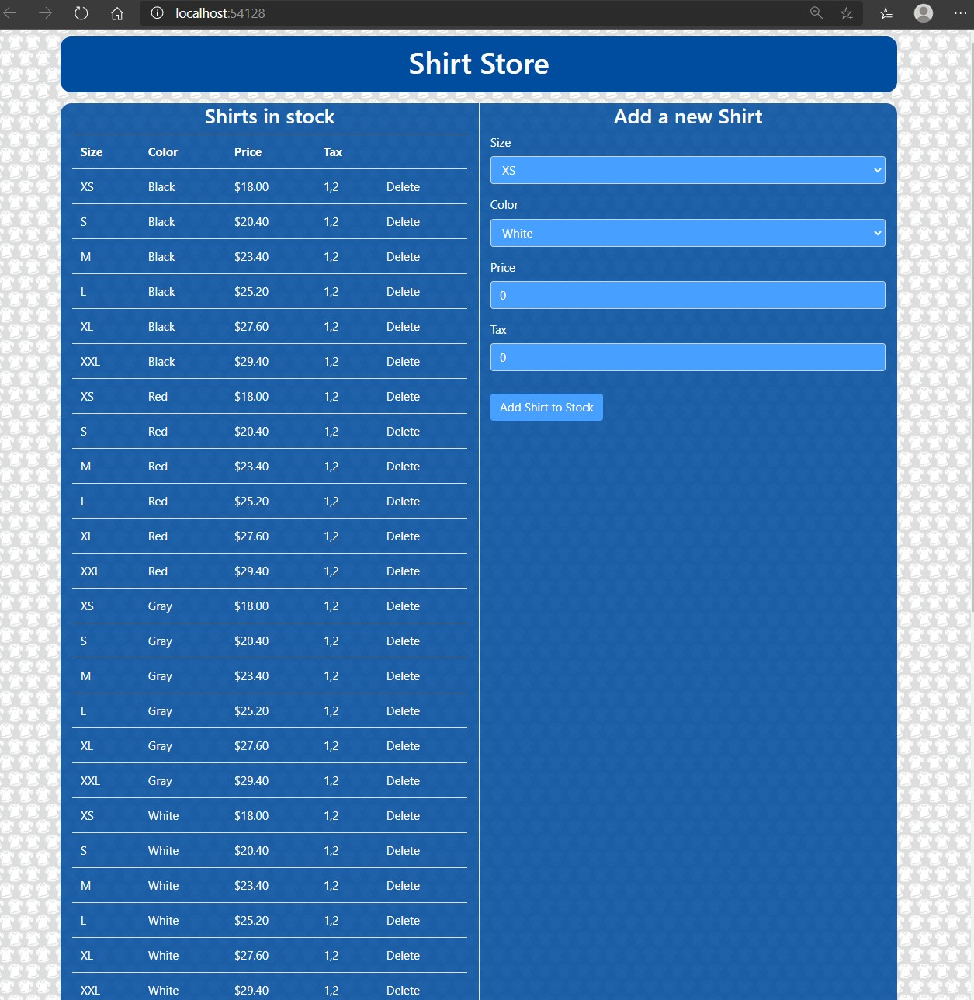

# Module 10: Testing and Troubleshooting

## Lab: Testing and Troubleshooting

1. **Nombres y apellidos:** Francisco Javier Moreno Quevedo
2. **Fecha:** 02/12/2020
3. **Resumen del Ejercicio:** implementar un repositorio en el proyecto
4. **Dificultad o problemas presentados y como se resolvieron:** Ninguna

Ejercicio 3: Implementing a Repository in the MVC Project

- En el proyecto **ShirtStoreWebsite** añadimos en la carpeta **Services** la clase **ShirtRepository.cs**

- EN el middleware reggistramos la clase como un servicio

- Ejecutamos la aplicacion

  

